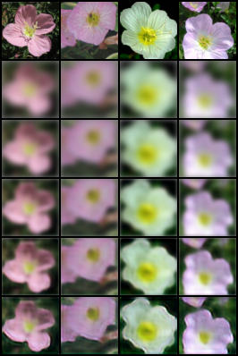
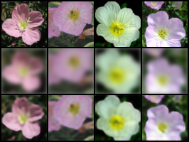
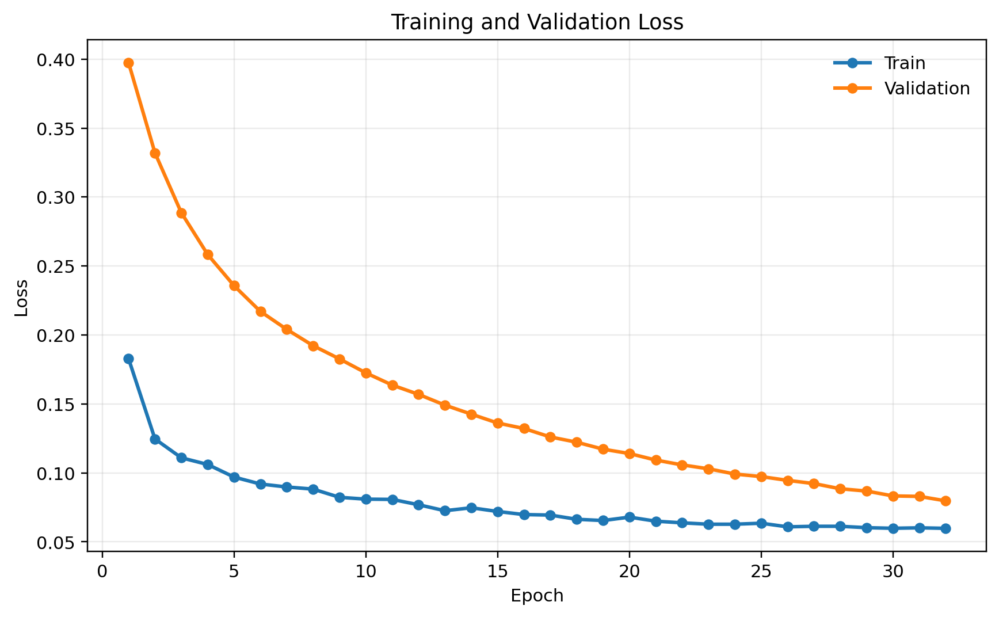
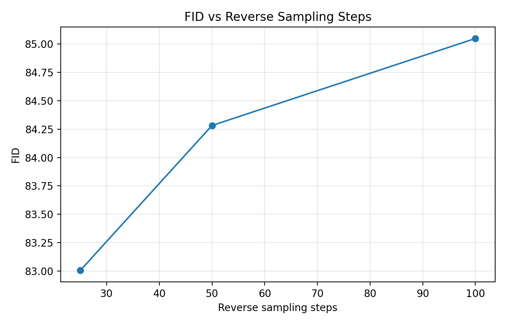

<p align="center">
  
</p>

<h1 align="center">Cold Diffusion for Flower Image Generation</h1>
<p align="center">
  <em>Reversing Deterministic Blur from Scratch with a Time-Conditioned U-Net</em>
</p>

<p align="center">
  From-scratch PyTorch implementation of a cold diffusion model on Oxford 102 Flowers
</p>

<p align="center">
  <strong>COMP8221 – Advanced Machine Learning</strong><br>
  Assignment 1 · Macquarie University<br>
  Alireza Yegane
</p>

<p align="center">
  
  
  
  
  
</p>

---

## Overview

This project explores a simple but visually strong alternative to standard diffusion.

Instead of corrupting images with random Gaussian noise, it uses **deterministic Gaussian blur** as the forward process and trains a **time-conditioned U-Net** to recover the clean image from a blurred one. That choice makes the reverse process much easier to inspect. Rather than feeling abstract, the model behaviour becomes something you can actually watch: colour comes back, flower centres reappear, and petal structure gradually sharpens over time.

The project was built as a **from-scratch non-standard diffusion implementation** for **COMP8221 – Advanced Machine Learning**.

---

## Why this approach?

Most diffusion projects are built around noise prediction. This one takes a different direction.

By replacing stochastic corruption with deterministic blur, the reverse trajectory becomes far more interpretable. That made this project especially nice to work on, because debugging, visual analysis, and qualitative evaluation all became much more direct.

This setup was chosen because it is:

- a valid non-standard diffusion variant
- practical to implement from scratch
- visually intuitive
- easy to analyse step by step
- well suited to a compact academic project with clear results

---

## Method

The full pipeline is straightforward:

1. Start from a clean image `x0`
2. Apply timestep-dependent Gaussian blur to obtain `xt`
3. Train the model to predict the clean image from `(xt, t)`

At inference time, the model starts from a heavily blurred image and reconstructs it progressively through a learned reverse process.

### Main components

- deterministic Gaussian blur forward process
- time-conditioned U-Net
- sinusoidal timestep embeddings
- L1 reconstruction objective
- EMA checkpointing
- reverse-process visualisation
- FID-based evaluation
- reverse-step ablation

---

## Dataset

This project uses the **Oxford 102 Flowers** dataset.

- 102 flower categories
- official train / validation / test split
- images resized to **64 × 64**
- normalized to `[-1, 1]`

This dataset works particularly well here because flowers have rich colour structure, curved boundaries, layered textures, and visually obvious degradation under blur. That makes restoration quality much easier to judge both qualitatively and quantitatively.

---

## Results

### Quantitative results

| Reverse steps | FID |
|---|---:|
| 25 | 83.00 |
| 50 | 84.28 |
| 100 | 85.05 |

In the current restoration-based setup, the **25-step** sampler performed best. That suggests a shorter reverse trajectory gave a slightly better quality-efficiency trade-off than the longer settings in this implementation.

### Qualitative behaviour

The most interesting part of the project is the reverse process itself. Across reverse steps, the model progressively restores:

- petal boundaries
- dominant colour structure
- flower centres
- overall shape consistency

Even when very fine texture is not perfectly recovered, the reconstruction trajectory remains visually clear and easy to interpret.

---

## Preview

### Reverse trajectory
<p align="center">
  
</p>

### Reconstruction examples
<p align="center">
  
</p>

### Training curves
<p align="center">
  
</p>

### FID ablation
<p align="center">
  
</p>

---

## Project Structure

```text
.
├── data/
│   ├── raw/
│   └── processed/
├── notebooks/
├── outputs/
│   ├── checkpoints/
│   ├── figures/
│   ├── metrics/
│   ├── report_figures/
│   └── samples/
├── scripts/
├── src/
├── logo/
├── README.md
└── requirements.txt
```

---

## Setup

### Clone the repository

```bash
git clone https://github.com/AlirezaYegane/Cold-Diffusion-for-Flower-Image-Generation.git
cd Cold-Diffusion-for-Flower-Image-Generation
```

### Create a virtual environment

**Windows**
```bash
python -m venv .venv
.venv\Scripts\activate
```

**Linux / macOS**
```bash
python -m venv .venv
source .venv/bin/activate
```

### Install dependencies

```bash
pip install -r requirements.txt
```

---

## Dataset Preparation

Place the Oxford Flowers files inside `data/raw`:

- `102flowers.tgz`
- `imagelabels.mat`
- `setid.mat`

Then extract the image archive so the JPEG files are available under:

```text
data/raw/jpg
```

---

## How to Reproduce the Main Results

The exact filenames may vary slightly depending on your local setup, but the overall workflow is:

### 1. Inspect the dataset

```bash
python src/check_dataset.py
python src/preview_images.py
```

### 2. Run the tiny-overfit sanity check

```bash
python scripts/train_tiny_overfit.py
```

This step verifies that the data pipeline, degradation process, model forward pass, and optimisation loop are all working correctly before launching the full run.

### 3. Train the main model

```bash
python src/train.py
```

### 4. Generate qualitative outputs

```bash
python src/sample.py
```

This produces reconstruction examples and reverse-process visualisations.

### 5. Run evaluation

```bash
python src/eval.py
```

### 6. Export report-ready figures

```bash
python scripts/plot_training_curves.py
python scripts/plot_fid_ablation.py
```

---

## Notes

This project is currently evaluated in a **restoration-based** setting rather than fully unconditional generation.

In other words, the reverse process starts from a maximally blurred validation image and reconstructs it progressively. That keeps the cold diffusion idea intact while making the model behaviour much easier to inspect, explain, and discuss.

---

## Reproducibility

The repository is organised to keep experiments easy to follow:

- modular source code
- saved checkpoints
- logged metrics
- saved qualitative outputs
- report-ready figures
- notebook-based final presentation

The goal was to keep the code readable, practical, and easy to inspect rather than overly complicated.

---

## Acknowledgements

- COMP8221 – Advanced Machine Learning
- Oxford 102 Flowers Dataset
- PyTorch and the open-source ML ecosystem

---

## License

This repository is provided for academic and educational use.